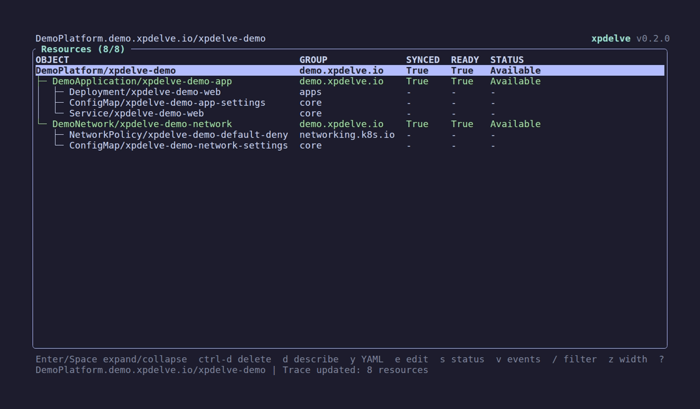

# xpdelve

`xpdelve` is a responsive terminal explorer for Crossplane resource traces. It
invokes `crossplane resource trace -o json`, projects the result into an
interactive tree, and keeps the current tree usable while refresh work runs in
the background.

The project is an opinionated Rust successor to
[`xpdig`](https://github.com/brunoluiz/xpdig), with an architecture influenced
by [`sofka`](https://github.com/nklmilojevic/sofka). Portions are adapted from
both projects under Apache-2.0; see [`NOTICE`](NOTICE) for detailed provenance.



The reproducible nested-Composition environment and VHS recording used for the
project demo are documented in [`demo/`](demo/README.md).

## Status

xpdelve provides live trace browsing, resilient refresh, tree find/filter,
native Kubernetes inspection and mutations, and kubectl-backed Describe and
Edit workflows. See
[`docs/implementation.md`](docs/implementation.md) for remaining release work.

## Installation

### Install script

Install the latest release for the current platform to
`~/.local/bin/xpdelve`:

```console
curl -fsSL https://raw.githubusercontent.com/allanyung/xpdelve/main/install.sh | sh
```

The installer also removes the Gatekeeper quarantine attribute on macOS.

### Manual installation

Download the archive for your platform from the GitHub release:

- `xpdelve_VERSION_Linux_x86_64.tar.gz`
- `xpdelve_VERSION_Linux_arm64.tar.gz`
- `xpdelve_VERSION_Darwin_x86_64.tar.gz`
- `xpdelve_VERSION_Darwin_arm64.tar.gz`

Extract the archive and place `xpdelve` somewhere on your `PATH`:

```console
tar -xzf xpdelve_VERSION_Linux_x86_64.tar.gz
install -m 0755 xpdelve ~/.local/bin/xpdelve
```

Linux archives use the GNU ABI and are built on Ubuntu 22.04. macOS binaries
are currently unsigned and not notarized. Windows and musl builds are not
currently provided.

On macOS, Gatekeeper may prevent the unsigned binary from running. Remove the
quarantine attribute after extracting it:

```console
xattr -d com.apple.quarantine ~/.local/bin/xpdelve
```

## Prerequisites

### Runtime

- Linux or macOS
- A Crossplane CLI version that provides `crossplane resource trace -o json`
- `kubectl` for Describe and Edit actions
- Access to a Kubernetes cluster through the normal kubeconfig environment

### Building From Source

- Rust 1.98.1
- A C compiler, linker, CMake, and platform development tools
- [go-task](https://taskfile.dev/) for the recommended contributor workflow

## Usage

```console
xpdelve ObjectStorage/example
xpdelve --namespace default ObjectStorage example
xpdelve --context development ObjectStorage/example
```

Configuration is read from `~/.config/xpdelve/config.toml`. See
[`docs/configuration.md`](docs/configuration.md).

### Sofka Integration

`xpdelve` can be launched for the selected Kubernetes resource from
[`sofka`](https://github.com/nklmilojevic/sofka). Ensure `xpdelve` is available
on your `PATH`, then add this plugin to your Sofka configuration file:

```toml
[[plugins]]
key = "ctrl-t"
palette = "xpdelve"
name = "Crossplane Delve"
command = "xpdelve"
args = ["-n", "$NAMESPACE", "--context", "$CONTEXT", "$RESOURCE.$GROUP/$NAME"]
mutating = false
output = "terminal"
timeout = "10s"
```

Select a Crossplane resource in Sofka and press `ctrl-t` to open its resource trace
in `xpdelve`. Sofka supplies the selected resource's namespace, kubeconfig
context, resource, API group, and name through the variables in `args`.

## Keys

- `j`/`k` or `Up`/`Down`: move through resources
- `Enter`/`Space`: toggle expansion
- `Right`: expand or select the first child
- `Left`: collapse or select the parent
- `[`/`]`: collapse or expand the whole tree
- `/`: filter; `f`: find; `n`/`N`: next or previous match
- `d`, `y`, `s`, `v`: describe, live YAML, status, and events
- `p`/`u`: pause or unpause the selected Crossplane resource
- `ctrl+d`: delete with a propagation-policy confirmation
- `ctrl+x`: selectively remove finalizers after confirmation
- `e`: run `kubectl edit`
- `c`: copy the canonical resource identifier using OSC 52
- `z`: toggle fitted/full-width columns
- `r`: refresh; `P`: pause automatic refresh; `?`: help; `q`: quit

Delete confirmation defaults to foreground propagation. Press `c` in the
confirmation to cycle through foreground, background, and orphan behavior.

If the root resource can no longer be found, xpdelve clears the stale trace and
stops automatic polling. Press `r` to retry manually; successful recovery
restores the tree and normal refresh behavior.

## Mouse Support

On the main resource table, click a row to select it, double-click to open its
live YAML, or drag across displayed text to highlight and copy it on release.
Right-click a row for YAML, Edit, Events, and Describe actions. Describe, live
YAML, and Events offer the same drag-to-copy behavior; visual soft wraps are not
included as newlines.
Describe, YAML, and Events use the full terminal and wrap long lines. Content
views support `/` search and vertical scrolling. In YAML, `w` toggles wrapping;
`h`/`l` or Left/Right scroll unwrapped YAML horizontally.

## Themes

xpdelve supports the same built-in theme catalog as Sofka. Omit `skin.name` to
select Catppuccin Latte or Mocha based on the detected terminal background; if
detection fails, xpdelve defaults to Mocha. You can also configure a named theme
and optional swatch overrides.

See [`docs/configuration.md`](docs/configuration.md#themes) for available themes
and configuration options.

## Safety

Native mutations re-fetch the selected object and verify its UID. Deletes also
use UID and resource-version server preconditions; patches test UID and
resourceVersion atomically. Secret payloads are redacted in YAML views, and
untrusted cluster text is sanitized before terminal rendering. Non-Secret
resources may still contain credential-like values. Use `--readonly` to disable
mutations.

## Development

```console
task build
task test
task lint
task check
task run -- ObjectStorage/example
```

Task is the supported contributor interface. Cargo remains the underlying Rust
build system and can also be used directly.

To prepare a release from a clean `main` branch, provide its version without a
`v` prefix:

```console
task release VERSION=0.1.1
```

The task updates Cargo's package version and lockfile, runs the local CI gate,
then creates a release commit and annotated tag. It prints the command for
pushing the commit and tag; it does not push them automatically.

## License

Licensed under Apache License, Version 2.0. See `LICENSE` and `NOTICE`.
